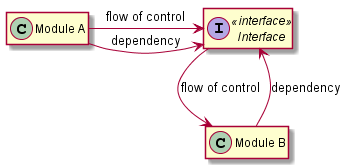
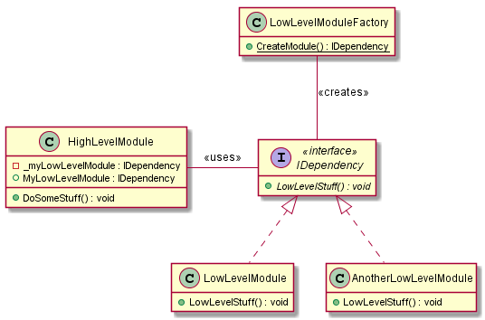
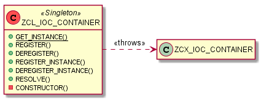

# Implementing an IoC Container in ABAP

## Preface

The following is an article describing my adventures of creating a naive implementation of an inversion of control container in ABAP.

The first part will focus on the Dependency Inversion Principle and ways of achieving it.
The second part will explain the ABAP implementation of the IoC container.

## Part 1 - Dependency inversion

The key to a modular application is [loose coupling][loosecoupling].
Loosely coupled components usually makes changes easier potentially reducing maintenance effort while also allowing separation of concerns and isolation for unit testing.

The way to achieve loose coupling in OO applications is to adhere to the [Dependency Inversion Principle][dip] (the _D_ of _[SOLID][solid]_).

### Dependency Inversion Principle

The dependency inversion principle roughly states that:

> high level components should not depend on low level components, but both should depend on abstractions.

Suppose our software consists of two cooperating modules, say module _A_ and _B_.
If _A_ uses some functionality of _B_, then _A_ is _dependent_ on _B_ (i.e. _B_ is a dependency of _A_).

This relation also means that functionality implemented in _B_ is abstracted away from the point of view of _A_, thus _B_ is at a lower level of abstraction.
Since _A_ is calling _B_ the flow of control also points in the same direction as the dependency, i.e. from _A_ to _B_.


To resolve this dependent state between _A_ and _B_ we can introduce an abstraction layer (e.g. an interface) between the two components to flip the direction of the dependency.

By inserting the interface between the two components _A_ will now depend on _I_ (the abstraction) rather than directly on _B_ while _B_ will also depend on _I_ (implementing the interface in this case).
The flow of control will still go from _A_ to _I_ to _B_, however the direction of the dependency will point _against_ the flow of control in the relation of _I_ to _B_.

This way both our components will depend on an abstraction rather than the high level component depending on the low level one.
This creates loose coupling, as we now can easily switch _B_ to a different module, as long as we adhere to the contract defined by the abstraction _I_.



### Dependency injection

[Dependency injection][dependency_injection] is a way of putting the Dependency Inversion Principle into practice.
In order for our software to work we need to supply _A_ with its dependency _B_ without _A_ knowing the concrete dependency.

If _A_ is using _B_ via an abstraction, but it is newing up _B_ directly then the abstraction doesn't serve it's purpose, as _A_ will still be tightly coupled to _B_.

To get the dependency to _A_ we can use several techniques, which are collectively known as dependency injection.
These (among others) could be:

- Constructor injection
- Property injection (a.k.a. Setter injection)
- Factories
- Inversion of Control containers

For the examples below I will use some variation of the following classes:



#### Constructor injection

When using constructor injection, the dependency is injected via a parameter through the constructor and stored as an attribute.
The following code example shows this in C#.

```C#
public interface IDependency
{
	void LowLevelStuff();
}

public class HighLevelModule
{
	private IDependency _myLowLevelModule;

	public HighLevelModule(IDependency lowLevelModule)
	{
		_myLowLevelModule = lowLevelModule;
	}

	public void DoSomeStuff()
	{
		Console.WriteLine("I'll do some stuff");
		_myLowLevelModule.LowLevelStuff();
	}
}

public class LowLevelModule: IDependency
{
	public void LowLevelStuff()
	{
		Console.WriteLine("In LowLevelModule");
	}
}

public class AnotherLowLevelModule: IDependency
{
	public void LowLevelStuff()
	{
		Console.WriteLine("In AnotherLowLevelModule");
	}
}

public class Program
{
	static void Main(string[] args)
	{
		var lowLevelModule = new LowLevelModule();
		var highLevelModule = new HighLevelModule(lowLevelModule);
		highLevelModule.DoSomeStuff();
	}
}
/*
This code example produces the following results:

I'll do some stuff
In LowLevelModule
*/
```

Instead of the high level module creating its own dependency, it is supplied upon creation with it.

Since the high level module only knows about the abstraction (note the type of the attribute and the constructor parameter), it will not be tightly coupled to the concrete implementation.

#### Property injection

The idea of property injection is quite similar to that of the constructor injection, but instead of supplying the dependency during object creation, it can be set using a property or setter method.

Reworking the above example:

```C#
...
public class HighLevelModule
{
	private IDependency _myLowLevelModule;
	public IDependency MyLowLevelModule { set => _myLowLevelModule = value; }

	public HighLevelModule()
	{
		// Use LowLevelModule by default
		_myLowLevelModule = new LowLevelModule();
	}
...
}
...

public class Program
{
	static void Main(string[] args)
	{
		var highLevelModule = new HighLevelModule();
		highLevelModule.DoSomeStuff();

		var anotherLowLevelModule = new AnotherLowLevelModule();
		highLevelModule.MyLowLevelModule = anotherLowLevelModule;
		highLevelModule.DoSomeStuff();
	}
}
/*
This code example produces the following results:

I'll do some stuff
In LowLevelModule
I'll do some stuff
In AnotherLowLevelModule
*/
```

Note that the property is public so it can be changed from outside the class.

It is also possible to have a baked in default dependency (as in the code above), which then can be changed during runtime using the property setter.

#### Factories

Another solution is to have a dependency factory, that supply an abstraction and use that in the constructor.

```C#
...
public static class LowLevelModuleFactory {
	public static IDependency CreateModule()
	{
		return new LowLevelModule();
	}
}

public class HighLevelModule
{
	private IDependency _myLowLevelModule;

	public HighLevelModule()
	{
		// Use LowLevelModule by default
		_myLowLevelModule = LowLevelModuleFactory.CreateModule();
	}
...
}
...
public class Program
{
	static void Main(string[] args)
	{
		var highLevelModule = new HighLevelModule();
		highLevelModule.DoSomeStuff();
	}
}
/*
This code example produces the following results:

I'll do some stuff
In LowLevelModule
*/
```

This is a solution somewhere between a constructor injection and a property injection.
It is typically also possible to configure the factory which concrete implementation it should create.

The advantage of using factories is that the object creation is localized inside the factory instead of being scatter throughout the application (see also [Factory Method][factory]).

#### Inversion of Control containers

The idea behind Inversion of Control containers (or IoC containers for short) is to have an object that knows how to get hold of those dependencies that will be needed throughout the life of our application.

We configure the IoC container upon startup telling which concrete implementations it should supply and then leave the object creation to the IoC container.
The following example shows a way of doing it in C# using the [Autofac][autofac] NuGet Package.

```C#
...
public class Program
{
	private static IContainer Container { get; set; }

	static void Main(string[] args)
	{
		var builder = new ContainerBuilder();
		builder.RegisterType<LowLevelModule>().As<IDependency>();
		Container = builder.Build();

		var highLevelModule = new HighLevelModule();
		highLevelModule.DoSomeStuff();
	}
}
```

The container is configured to return `LowLevelModule` instances for `IDependency`.
Upon creating the `HighLevelModule` the IoC container will realize that an `IDependency` is needed which was not supplied and supply the constructor with a `LowLevelModule` as configured.

### An ABAP IoC Container

The constructor injection, property injection and factories can easily be implemented in ABAP as in any other OO language.
However -- as far as I know -- there is currently no standard solution for an IoC container in ABAP.

Since the ABAP language supports runtime type information via the [Runtime Type Services (RTTS)][rtts] it seems possible to implement an IoC container and in the second part of this article I will describe one way of doing it.

## Part 2 - The ABAP IoC Container

The following class diagram shows the IoC container (click on the image to get a more detailed version).

[](./img/zcl_ioc_container_detailed.png)

The usage examples will be taken (in a somewhat modified form) from the unit tests created for the container.
These will use a set of objects that were defined for testing and demostration purposes.
The following class diagram shows these classes and interfaces.

[](./img/test_classes.png)


### Usage

To use the IoC container, first you must obtain an instance of it.

```abap
DATA(ioc_container) = zcl_ioc_container=>get_instance( ).
```

Objects can be registered in two ways into the container.
Simply by their name (`register` method), or by an instance (`register_instance`).

The `register` method will simply create a mapping between an interface name and a class name.
Whenever this interface is requested from the container, it will assume that an instance of the registered class should be created.

The `register` method also does some checks about the registered class to see wether it can be instantiated by the IoC container.
It checks:

- If the class is `CREATE PUBLIC` or friends with the container
- If the class is instantiatable (i.e. not an abstract class)

If either of the above checks fail the register method will throw a `ZCX_IOC_CONTAINER` exception with the text indicating the reason of the failure.

```abap
ioc_container->register(
	interface_name = `zif_ioc_b`
	class_name     = `zcl_ioc_b_subcl`
).

DATA(ioc_b) = ioc_container->resolve( `zif_ioc_b` ).

cl_abap_unit_assert=>assert_bound( ioc_b ).

cl_abap_unit_assert=>assert_true(
	xsdbool( ioc_b IS INSTANCE OF zcl_ioc_b_subcl )
).
```

The `register_instance` method can be used to register an object instance for a given interface.
If a registered instance exists for an interface name, then that instance will always be returned by the container.
This can be used for test double injection (as seen in the below example).

```abap
DATA(ioc_a) = CAST zif_ioc_a( cl_abap_testdouble=>create( `zif_ioc_a` ) ).

ioc_container->register_instance(
	interface_name = `zif_ioc_a`
	instance       = ioc_a
).

cl_abap_unit_assert=>assert_equals(
	exp = ioc_a
	act = ioc_container->resolve( `zif_ioc_a` )
).
```

Both `register` and `register_instance` have a corresponding `deregister` and `deregister_instance` method counterpart.
These methods can either be called with an interface name or without it.

Calling with an interface name will remove that specific mapping, while calling it without an input parameter will clear out all the registered mappings.

```abap
ioc_container->deregister( `zif_ioc_b` ).

cl_abap_unit_assert=>assert_not_bound(
	ioc_container->resolve( `zif_ioc_b` )
).

ioc_container->deregister_instance( `zif_ioc_a` ).

cl_abap_unit_assert=>assert_not_bound(
	ioc_container->resolve( `zif_ioc_a` )
).
```

The method `resolve` is used to get an instance of a registered interface (as seen in the above examples).
Since object creation issues are most likely already dealt with during the `register` call, `resolve` will not throw exceptions but simply return a `null` object if the object creation fails for some reason.

The `resolve` method can also be called directly with class names.
In this case no mapping is needed beforehand and the requested class will be instantiated.

```abap
DATA(ioc_b) = ioc_container->resolve( `zcl_ioc_b_subcl` ).

cl_abap_unit_assert=>assert_bound( ioc_b ).

cl_abap_unit_assert=>assert_true(
	xsdbool( ioc_b IS INSTANCE OF zcl_ioc_b_subcl )
).
```

To see more examples of usage please check out the unit tests in the [corresponding source code][tests] file.

### Implementation

The mappings and registered instances are stored in simple hash tables, but the central part of the IoC container is the dynamic object creation done in the `resolve` method.
For this I have used the [Runtime Type Services (RTTS)][rtts] which can give information about variables, types, method parameters etc. during runtime.

By using the object descriptor created based on the class's name (`cl_abap_classdescr=>describe_by_name`) we can get hold of the parameter list of the constructor method with all type information.
We can then iterate through the parameters and resolve them one by one.

Should an input parameter be a simple type, it can be created with an initial value, and should it be an interface type, it can be (recursively) resolved by the IoC container itself.

The generic [object creation][create] can be used to create the instance with a table containing the constructor parameters.

The complete source code can be found [here][container].

## Personal thoughts and improvement possibilities

This IoC container is far from being production ready.
I have made tests with a some classes and as far as I could tell it is quite stable, however I certainly did not do exhaustive testing.
I am also pretty much sure that there's room for improvement regarding performance.

All in all, the motivation of creating this IoC container was first and foremost curiosity.
Although as of now I have not used it in any complex application, I can see the possibility of using it instead of factory classes.

Suppose my application uses a set of utility classes.
Instead of having factories for all the utility classes, the IoC container could be used to supply the required instances.
When doing unit/integration testing the container can be preloaded with test double instances using the `register_instance` method.

The source code, along with the exception class, unit tests and the classes/interfaces created for the unit tests can be found in [this GitHub repository][github].

In case you have questions or suggestions please feel free to reach out to me or open an issue or a pull request.
You can find me on twitter [@bothzoli](https://twitter.com/bothzoli) (DM's are open).

## Resources

I have learned a lot from the following resources about dependency injection, I gladly recommend them if you're interested in this topic.

- [Uncle Bob on the SOLID principles](https://www.youtube.com/watch?v=zHiWqnTWsn4)
- [A great article by Martin Fowler on dependency injection](https://www.martinfowler.com/articles/injection.html)
- [Jeremy Clark's Pluralsight course on dependency injection in .NET](https://app.pluralsight.com/library/courses/using-dependency-injection-on-ramp)

I have used [PlantUML](http://plantuml.com/) to create the diagrams in this article.

[loosecoupling]: https://en.wikipedia.org/wiki/Loose_coupling
[dip]: https://en.wikipedia.org/wiki/Dependency_inversion_principle
[solid]: https://en.wikipedia.org/wiki/SOLID
[dependency_injection]: https://en.wikipedia.org/wiki/Dependency_injection
[factory]: https://en.wikipedia.org/wiki/Factory_method_pattern
[autofac]: https://autofac.org/
[rtts]: https://help.sap.com/doc/abapdocu_750_index_htm/7.50/en-US/abenrtti.htm
[tests]: https://github.com/bothzoli/ABAP-IoC-Container/blob/master/src/tests/zcl_ioc_container_tests.abap
[create]: https://help.sap.com/doc/abapdocu_752_index_htm/7.52/en-us/abapcreate_object_para_tables.htm
[container]: https://github.com/bothzoli/ABAP-IoC-Container/blob/master/src/zcl_ioc_container.abap
[github]: https://github.com/bothzoli/ABAP-IoC-Container/tree/master/src